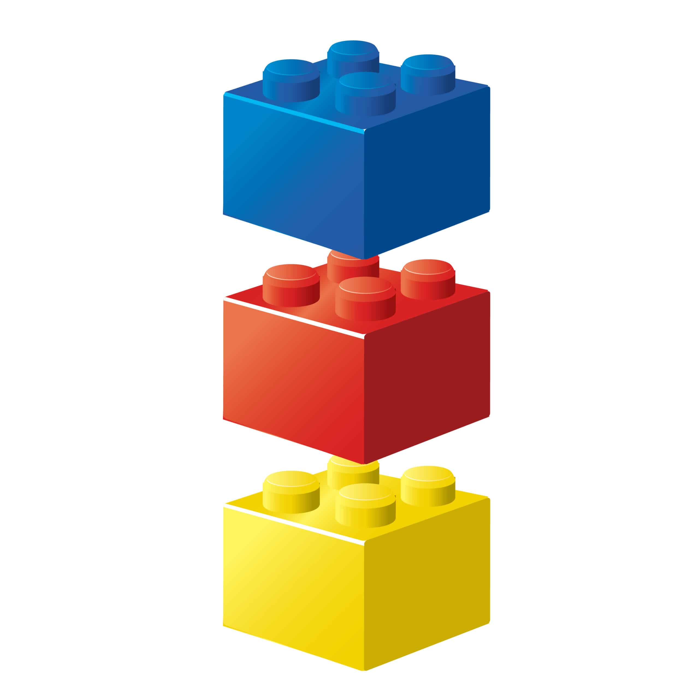
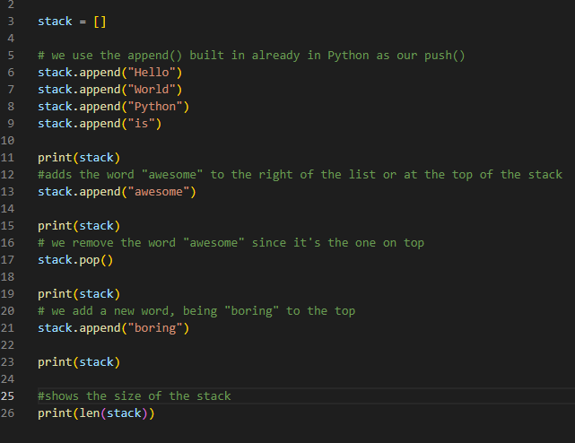

# Stacks

## Introduction

When you're building a lego tower you have to build up one piece at a time. To get the highest tower, you're going to have to stack lego brick after lego brick on top of each other. The same thing can be thought of with Stacks in programming. You start with one lego brick. That's the first item in the stack. When you add a lego brick on top you're "pushing" a new piece like using the push operation to add an item to the a stack in python it adds to the back or on top of the stack. When we remove an item by using the pop function we remove the last item. That can result in data in the front not being used for quite some time. 

## Functions Associated with Stack

- empty() - Returns whether the stack is empty - Time Complexity: O(1)
- size() - Returns the size of the stack - Time Complexity: O(1)
- top() / peek() - Returns a reference to the topmost item of the stack - Time Complexity: O(1)
- push(a) - inserts the item 'a' at the top of the stack - Time Complexity: O(1)
- pop() - Deletes the topmost item of the stack - Time Complexity: O(1)

These functions will help you manipulate your stack. Notice they all have a Big-O notation of just O(1) meaning it's constant regardless of the size of the data set. Performance doesn't get better or worse with size. 

## Implementation and Example

A real world example for using a stack would be if you were working on a brand new word processor. The stack comes in handy if you're going to inlcude an undo function. You can add everything to a stack by pushing it in. Then if the person using the word processor wants to undo their last action, they can just pop it. 

Example creating and using a stack, pushing elements and pop (removing) one. Also we measure the size by using the Len() method. 

* [Link to Stack example code](exampleStacks.py)

## Practice Problem
You've been asked by your boss to create a stack of the following items: 
- cheese
- bread
- ham
- beans
- rice
- cucumbers

However, the next day he's asked ou to remove cucumbers, rice and beans, but instead wants you to add kool-aid. Then he wants you to print out the list to the console. 

Do the following
- create a new stack
- add the listed items above
- remove the requested items
- add the new item
- print to the console
- add a function to count the number of items from the list

Trying doing this without looking back at the example above. Use the example above as a guide.

