# Linked Lists

## Introduction
Linked lists are a lesser-known type of list in python. In the right context they can do well. The biggest difference between a linked list and a regular list is the way the data is stored. Lists in general use a contiguous memory block to store refercences, linked lists store references as part of their own elements. 

Every element is called a node. Each node there are two things. 

1. Data - the value of the node
2. Next - the reference to the next node

Think of it like a snake. The first node is called the head and is used as the starting point of any iteration, typically. The tail or end of the node has a next reference pointing to none.

## Performance Comparison Lists vs. Linked Lists

Efficiency is the key difference between the two. So you need to see what your problem needs.

Most important: 

* Insertion in the middle O(1) for linked list, O(n) for a normal list
* Accessing an element in the middle O(n) for linked list, O(1) for a normal list. 

Think of a normal list, usually called an array, as boxes in a bookcase. When you remove a box from a row, all the boxes have to be moved one shelf down. However, a linked list is like a necklace. When you don't one of the jewels that's somewhere on the line, you can take it out and tie the ends together. You don't need to loop through the whole list to move anything. 

## Implementing Linked Lists

### Creating a linked list

1. You need to create a class to represent your linked list with a head to have a root
2. create another class to represent your nodes
3. define the node's data and next values

See below for an example. 

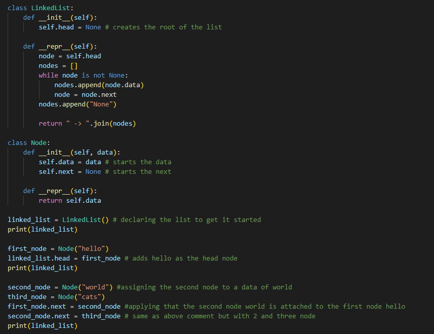

* [Link to code](exampleLists.py)

### Traversing a Linked List

Going through every node requires a couple of extra steps to get things set up for iteration. 

1. need to create a new function under the linked list class in our example
2. use any normal for or while loops to traverse

see below for an example

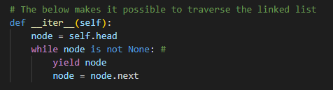
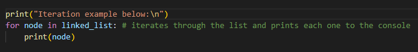

### Inserting a New Node

What good is a list if you can't add anything to it? Not much. So now lets see about adding a new node or element to the beginning, the end and the middle of our linked list. 

1. Adding to front 
You need to add a new function to your linked list class that adds to the head of the linked list. You just need to create a new node and then pointing the head of the list to it. 

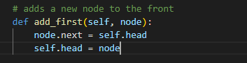
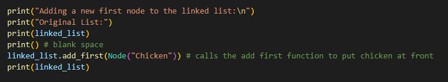

2. Add to the end
In order to add to the end, we are going to traverse the whole list until we reach the end. The for loop raises a StopIteration exception. Then we set the current_node as the last node. Then we add the the new node as the "next" value of the current node, thus pushing it to the last place. 

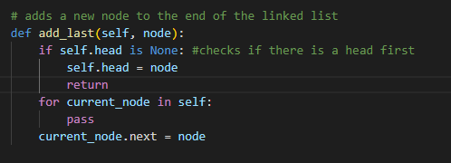
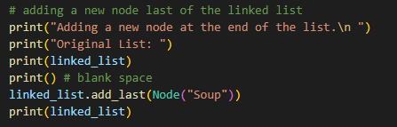

3. Add somewhere in the middle
You're not stuck with the option of just adding a new item in the front and end. You can add things anywhre in your linked list. You just need to know where you want to put it. In this guide we will just look at inserting before an existing node. 

You first traverse the the linked list looking for the node with the data indicating where you want to insert a new node. When it's found you will insert immediatley beforeand reassign the next values.

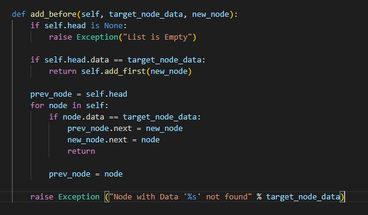
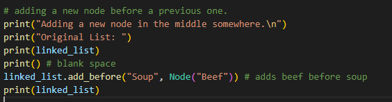

## Example

Throughout this lesson we've been using the same example through out. Here is the code in it's entirety: 

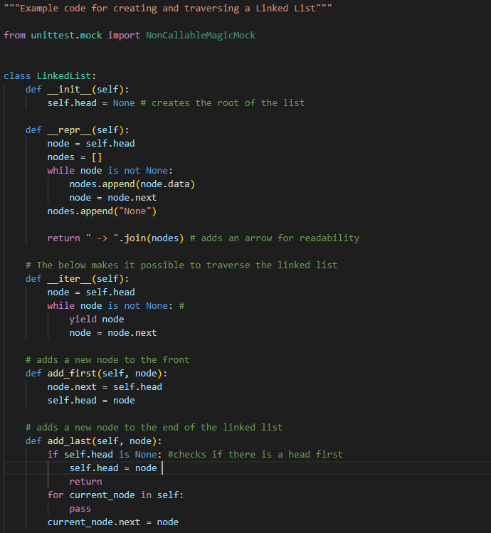
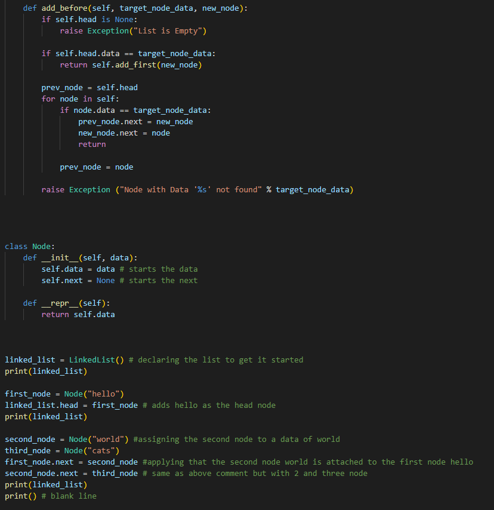
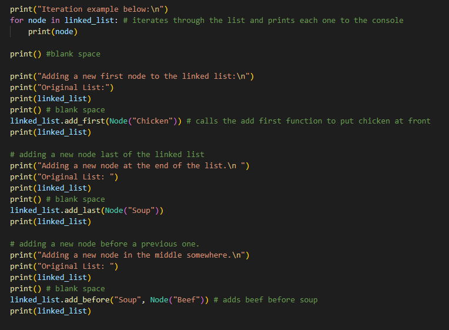

## Practice Problem

Now it's your turn. We will be creating a shopping list to make some delicious brownies. 
1. Create a linked list with the following items in the same order ["chocolate bar", "Flour", "eggs"]
2. Now you need to add "vegetable shortening" but add it to the beginning of the linked list.
3. Now add "sugar" to the end of the linked list.
4. To finish it up add "butter" in between "flour" and "eggs"
5. Print out the list. 

- [solution](solutionLists.py)