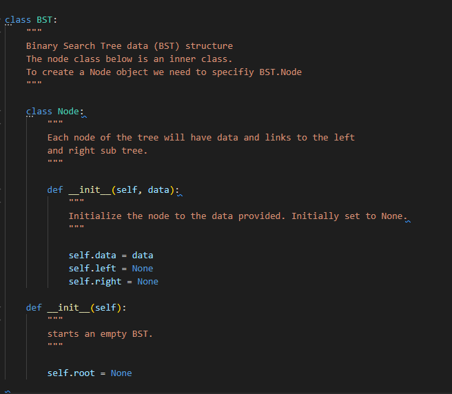

# Trees

## Introduction
Binary Trees is a type of data structure like a linked list or even a stack. It's a structure that holds data. A big difference for this for every node the most children nodes that will be underneath is two. 

Python doesn't have a tree system built into it. There are plenty of extensions for Python that you can download to make it a lot easier. A popular one you can install via pip is "binarytree". However, we're going to build a class that will act as a Binary Tree.

## Creation

What determines where values go in a tree are the values. You start at the root, then the next number if it's bigger than the root you add it to the right, then if smaller, add it to the left. You most certainly want to add the values in a random order. That way your tree becomes balanced. With things spread out if you need to traverse to add or find something, it will have a big O notation of O(log n). 

If you added everything in order. Then you would end up with a straight line. See below

This is considered unbalanced and has a big O notation of O(n). Thus kind of defeating the purpose of having a tree in the first place. 

Let's start creating our Binary search tree (BST)

1. We will create a new class called BST
2. Then create a sub class for our Node.
3. We are going to set the data to None. 

Look at the code below. 

## Functions

As mentioned before Python does not have a built in BST class. However, like in any other kind of list there are some useful functions you may consider adding to your BST class. Some might be: 

- insert() *searches the tree and adds the new node to the appropriate spot*
- contains() *looks for a specific value within the tree*
- remove() *looks for a specific value and removes it*
- get_height() *returns how big or tall the tree is*
- traverse() *goes through the BST and makes for loops possible*

Let' create some of those functions together now to add to our BST class. 

### Inserting
 

### Removing

### Traversing

### Searching Through

## Example 

## Practice Problem