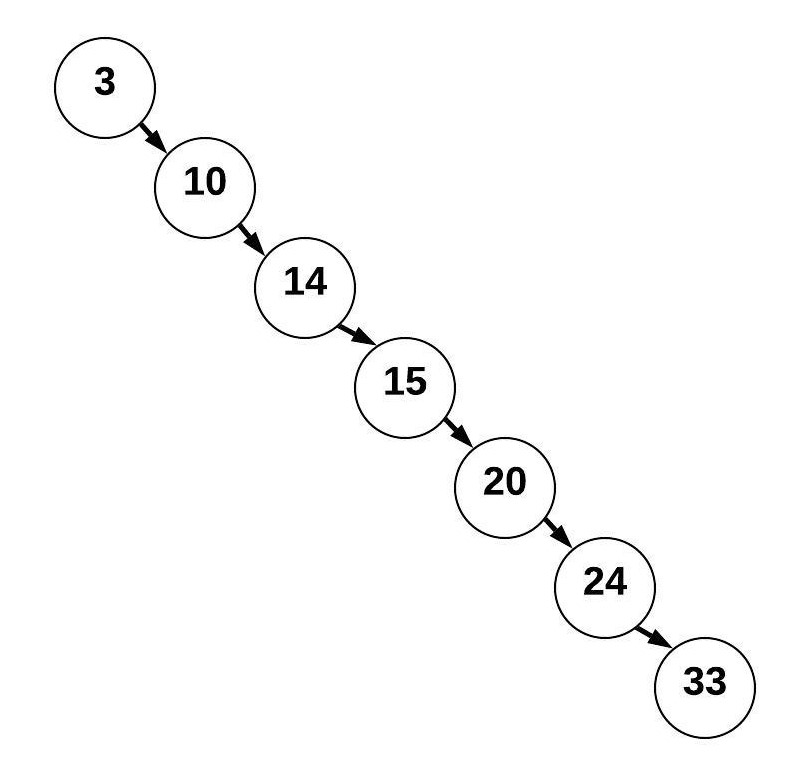

# Trees

## Introduction
Binary Trees is a type of data structure like a linked list or even a stack. It's a structure that holds data. A big difference for this for every node the most children nodes that will be underneath is two. 

Python doesn't have a tree system built into it. There are plenty of extensions for Python that you can download to make it a lot easier. A popular one you can install via pip is "binarytree". However, we're going to build a class that will act as a Binary Tree.

## Creation

What determines where values go in a tree are the values. You start at the root, then the next number if it's bigger than the root you add it to the right, then if smaller, add it to the left. You most certainly want to add the values in a random order. That way your tree becomes balanced. With things spread out if you need to traverse to add or find something, it will have a big O notation of O(log n). 

If you added everything in order. Then you would end up with a straight line. See below

This is considered unbalanced and has a big O notation of O(n). Thus kind of defeating the purpose of having a tree in the first place. 

Let's start creating our Binary search tree (BST)

1. We will create a new class called BST
2. Then create a sub class for our Node.
3. We are going to set the data to None. 

Look at the code below. 

## Functions

As mentioned before Python does not have a built in BST class. However, like in any other kind of list there are some useful functions you may consider adding to your BST class. Some might be: 

- insert() *searches the tree and adds the new node to the appropriate spot*
- contains() *looks for a specific value within the tree*
- remove() *looks for a specific value and removes it*
- get_height() *returns how big or tall the tree is*
- traverse() *goes through the BST and makes for loops possible*

Let' create some of those functions together now to add to our BST class. 

### Inserting

To insert we are going to need to add a method or another function to our BST class. The first thing is we are going to check if the root of the tree is None. If it is, then our new value will be the new root. 

Moving on, when we insert, we need to determine what side of the Node the new value is going to go on. Remember if the new value is less than the node before, it goes on the left. Then if it's more, it goes on the right. 

With that in mind we are just going to add logic that compares the new value with the root node. If it's less, then we check the left side if there is alreadya Node. If not then we found our spot. However, if there is already something there, we run the method again using the last left node as the node to compare then to continue till we find the spot. Of course if the new value is larger than the root node, we are checking the right side. 

See below for a code sample: 

### Contains

Next function we are going to add to our BST is a contains(). This function will go through the BST and check if a certain value is found within the BST. It is very similar to the insert function, however, instead of inserting something, you're just looking for a value. 

See below for a code sample:

### Traversing

Next we are going to write a function that will traverse through the tree in an ascending order. We will call it traverse_forward(). This function will not only traverse but put in order the nodes of the BST. You can see this when we print them out. 

See below for a code sample: 

## Example 

This is the full code all together from the pieces below. 

[Sample Code](3-trees.md)

## Practice Problem

Now it's your turn to write a couple of functions for your new BST class. 
Go ahead and write the 2 functions below:

1. A traverse function but in reverse. You will need to make two functions like the example. One to call it and the actual function.
2. A function that will find a value and remove it from the tree

See solution: 
[Solution Code](solutionTree.py)

[Return to Main](0-welcome.md)
